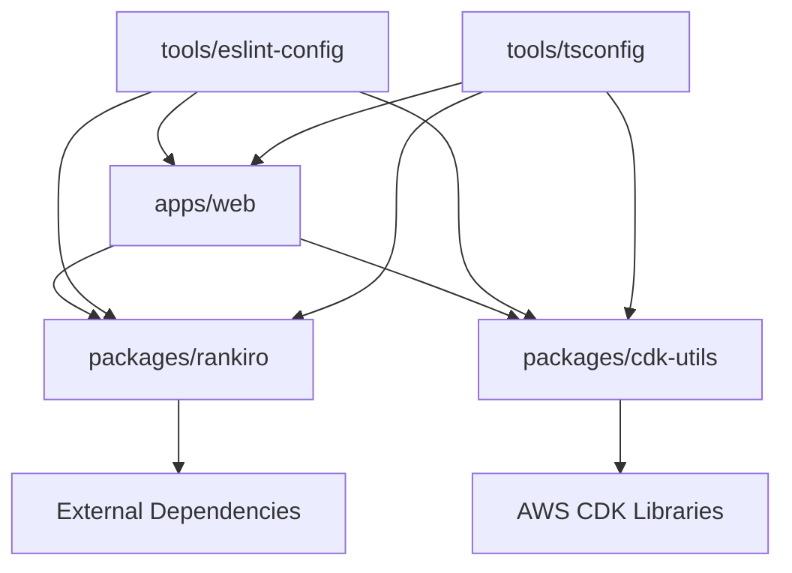

# Design Document

## Overview

The Monorepo Setup is a comprehensive development environment that establishes a modern TypeScript-based monorepo structure with AWS CDK infrastructure capabilities and web frontend development. The system leverages industry-standard tools including Turborepo for efficient task orchestration, pnpm for optimized package management, and a robust toolchain for code quality, testing, and deployment automation. The design emphasizes developer productivity, code consistency, and scalable architecture patterns suitable for both small teams and enterprise-level development.

## Architecture

### Monorepo Structure

```
project-root/
├── apps/
│   └── web/                    # Frontend React/Next.js application
│       ├── src/
│       ├── package.json
│       ├── tsconfig.json
│       └── next.config.js
├── packages/
│   ├── rankiro/               # Core business logic package
│   │   ├── src/
│   │   ├── package.json
│   │   └── tsconfig.json
│   └── cdk-utils/             # AWS CDK utility functions
│       ├── src/
│       ├── package.json
│       └── tsconfig.json
├── tools/
│   ├── eslint-config/         # Shared ESLint configuration
│   └── tsconfig/              # Shared TypeScript configurations
├── .github/
│   └── workflows/             # GitHub Actions CI/CD
├── package.json               # Root workspace configuration
├── pnpm-workspace.yaml        # pnpm workspace definition
├── turbo.json                 # Turborepo configuration
├── .gitleaksignore           # Gitleaks configuration
├── .husky/                   # Git hooks configuration
└── README.md
```

### Package Dependency Graph



### Technology Stack Integration

#### Core Technologies
- **TypeScript**: Primary development language with strict type checking
- **ESModules**: Modern module system for all packages
- **pnpm**: Fast, disk space efficient package manager with workspace support
- **Turborepo**: High-performance build system for JavaScript and TypeScript codebases

#### Code Quality Tools
- **Prettier**: Opinionated code formatter with consistent configuration
- **ESLint**: Pluggable linting utility with TypeScript support
- **Husky**: Git hooks made easy for automated quality checks
- **Gitleaks**: Detect and prevent secrets in git repos

#### Testing Framework
- **Jest**: JavaScript testing framework with TypeScript support
- **ts-jest**: TypeScript preprocessor for Jest

#### CI/CD Platform
- **GitHub Actions**: Automated workflows for testing, building, and deployment

## Components and Interfaces

### Package Structure Design

#### apps/web Package
```typescript
// apps/web/package.json structure
{
  "name": "@monorepo/web",
  "private": true,
  "dependencies": {
    "@monorepo/rankiro": "workspace:*",
    "@monorepo/cdk-utils": "workspace:*",
    "react": "^18.0.0",
    "next": "^14.0.0"
  },
  "devDependencies": {
    "@monorepo/eslint-config": "workspace:*",
    "@monorepo/tsconfig": "workspace:*"
  }
}
```

#### packages/rankiro Package
```typescript
// Core business logic interfaces
export interface RankingService {
  calculateRankings(data: VideoData[]): Promise<RankingResult[]>
  updateMetrics(metrics: MetricsData): Promise<void>
}

export interface DataProcessor {
  processVideoData(rawData: any[]): VideoData[]
  validateData(data: VideoData): boolean
}

// Package configuration
{
  "name": "@monorepo/rankiro",
  "main": "./dist/index.js",
  "types": "./dist/index.d.ts",
  "exports": {
    ".": {
      "import": "./dist/index.js",
      "types": "./dist/index.d.ts"
    }
  }
}
```

#### packages/cdk-utils Package
```typescript
// CDK utility interfaces and functions
export interface EnvironmentConfig {
  stage: 'dev' | 'staging' | 'prod'
  region: string
  accountId: string
}

export interface NamingConvention {
  getResourceName(resourceType: string, baseName: string): string
  getStackName(appName: string, stage: string): string
}

export class CDKNamingUtils {
  constructor(private config: EnvironmentConfig) {}
  
  createResourceName(type: string, name: string): string {
    return `${this.config.stage}-${name}-${type}`
  }
  
  getContextValue(scope: Construct, key: string): string {
    return scope.node.tryGetContext(key) || process.env[key.toUpperCase()]
  }
}

// Package exports
{
  "name": "@monorepo/cdk-utils",
  "main": "./dist/index.js",
  "types": "./dist/index.d.ts",
  "peerDependencies": {
    "aws-cdk-lib": "^2.0.0",
    "constructs": "^10.0.0"
  }
}
```

### Workspace Configuration

#### pnpm Workspace Configuration
```yaml
# pnpm-workspace.yaml
packages:
  - 'apps/*'
  - 'packages/*'
  - 'tools/*'
```

#### Turborepo Configuration
```json
{
  "pipeline": {
    "build": {
      "dependsOn": ["^build"],
      "outputs": ["dist/**", ".next/**"]
    },
    "test": {
      "dependsOn": ["^build"],
      "outputs": ["coverage/**"]
    },
    "lint": {
      "outputs": []
    },
    "type-check": {
      "dependsOn": ["^build"],
      "outputs": []
    },
    "dev": {
      "cache": false,
      "persistent": true
    }
  }
}
```

### Shared Configuration Packages

#### ESLint Configuration
```typescript
// tools/eslint-config/index.js
module.exports = {
  extends: [
    '@typescript-eslint/recommended',
    'prettier'
  ],
  parser: '@typescript-eslint/parser',
  plugins: ['@typescript-eslint'],
  rules: {
    '@typescript-eslint/no-unused-vars': 'error',
    '@typescript-eslint/explicit-function-return-type': 'warn',
    'prefer-const': 'error'
  },
  env: {
    node: true,
    es2022: true
  }
}
```

#### TypeScript Configuration
```json
// tools/tsconfig/base.json
{
  "compilerOptions": {
    "target": "ES2022",
    "module": "ESNext",
    "moduleResolution": "bundler",
    "strict": true,
    "esModuleInterop": true,
    "skipLibCheck": true,
    "forceConsistentCasingInFileNames": true,
    "declaration": true,
    "declarationMap": true,
    "sourceMap": true,
    "outDir": "dist",
    "rootDir": "src"
  },
  "exclude": ["node_modules", "dist"]
}
```

## Data Models

### Package Metadata Model
```typescript
interface PackageMetadata {
  name: string
  version: string
  dependencies: Record<string, string>
  devDependencies: Record<string, string>
  peerDependencies?: Record<string, string>
  exports: Record<string, ExportDefinition>
  scripts: Record<string, string>
}

interface ExportDefinition {
  import?: string
  require?: string
  types?: string
}
```

### Build Configuration Model
```typescript
interface BuildConfig {
  pipeline: Record<string, TaskDefinition>
  globalDependencies?: string[]
  globalEnv?: string[]
}

interface TaskDefinition {
  dependsOn?: string[]
  outputs?: string[]
  cache?: boolean
  persistent?: boolean
  env?: string[]
}
```

### Environment Configuration Model
```typescript
interface EnvironmentVariables {
  NODE_ENV: 'development' | 'production' | 'test'
  AWS_REGION?: string
  AWS_ACCOUNT_ID?: string
  STAGE?: 'dev' | 'staging' | 'prod'
}

interface CDKContext {
  stage: string
  region: string
  accountId: string
  domainName?: string
  certificateArn?: string
}
```

## Error Handling

### Package Resolution Errors
```typescript
class PackageResolutionError extends Error {
  constructor(
    public packageName: string,
    public requestedVersion: string,
    public availableVersions: string[]
  ) {
    super(`Cannot resolve package ${packageName}@${requestedVersion}`)
  }
}
```

### Build Process Error Handling
- **Dependency Resolution**: Clear error messages for missing or incompatible dependencies
- **TypeScript Compilation**: Detailed error reporting with file locations and suggestions
- **Linting Failures**: Actionable error messages with auto-fix suggestions where possible
- **Test Failures**: Comprehensive test result reporting with coverage information

### Git Hook Error Handling
- **Pre-commit Failures**: Clear indication of which checks failed and how to fix them
- **Secret Detection**: Specific guidance on removing detected secrets
- **Formatting Issues**: Automatic fixing where possible, manual intervention guidance otherwise

## Testing Strategy

### Unit Testing Configuration
```typescript
// jest.config.js (root)
module.exports = {
  projects: [
    '<rootDir>/apps/*/jest.config.js',
    '<rootDir>/packages/*/jest.config.js'
  ],
  collectCoverageFrom: [
    'src/**/*.{ts,tsx}',
    '!src/**/*.d.ts',
    '!src/**/*.test.{ts,tsx}'
  ],
  coverageThreshold: {
    global: {
      branches: 80,
      functions: 80,
      lines: 80,
      statements: 80
    }
  }
}
```

### Package-Specific Testing
```typescript
// packages/rankiro/jest.config.js
module.exports = {
  preset: 'ts-jest',
  testEnvironment: 'node',
  roots: ['<rootDir>/src'],
  testMatch: ['**/__tests__/**/*.test.ts'],
  collectCoverageFrom: [
    'src/**/*.ts',
    '!src/**/*.d.ts'
  ],
  setupFilesAfterEnv: ['<rootDir>/src/test-setup.ts']
}
```

### Integration Testing Strategy
- **Cross-package Integration**: Test interactions between packages
- **Build Process Testing**: Verify Turborepo pipeline execution
- **Dependency Resolution**: Test workspace dependency resolution
- **CI/CD Pipeline Testing**: Validate GitHub Actions workflows

### End-to-End Testing
- **Full Build Process**: Test complete build from clean state
- **Deployment Simulation**: Test CDK deployment processes
- **Development Workflow**: Test common developer workflows

## Performance Considerations

### Build Performance Optimization
- **Turborepo Caching**: Leverage remote and local caching for faster builds
- **Incremental Builds**: Only rebuild changed packages and their dependents
- **Parallel Execution**: Run independent tasks in parallel across packages
- **Dependency Optimization**: Minimize dependency graphs for faster resolution

### Package Management Optimization
- **pnpm Store**: Utilize pnpm's content-addressable store for disk space efficiency
- **Workspace Hoisting**: Optimize dependency installation with workspace hoisting
- **Lock File Management**: Maintain consistent dependency versions across environments

### Development Experience Optimization
- **Hot Module Replacement**: Fast refresh for development servers
- **TypeScript Incremental Compilation**: Faster type checking with incremental builds
- **ESLint Caching**: Cache linting results for unchanged files
- **Test Watch Mode**: Efficient test re-running for changed files

## Security Considerations

### Secret Management
```typescript
// .gitleaksignore configuration
# Allow specific patterns that are not actually secrets
[allowlist]
description = "Ignore test API keys"
regexes = [
  '''test-api-key-[a-zA-Z0-9]+''',
  '''mock-secret-[0-9]+'''
]
```

### Dependency Security
- **Audit Scanning**: Regular dependency vulnerability scanning
- **Version Pinning**: Pin critical dependencies to specific versions
- **Security Updates**: Automated security update workflows
- **License Compliance**: Track and validate package licenses

### Code Security
- **Static Analysis**: ESLint rules for security best practices
- **Type Safety**: Strict TypeScript configuration to prevent runtime errors
- **Input Validation**: Comprehensive validation for all external inputs
- **Error Handling**: Secure error handling that doesn't leak sensitive information

## Deployment and CI/CD

### GitHub Actions Workflow
```yaml
# .github/workflows/ci.yml
name: CI/CD Pipeline

on:
  push:
    branches: [main, develop]
  pull_request:
    branches: [main]

jobs:
  test:
    runs-on: ubuntu-latest
    steps:
      - uses: actions/checkout@v4
      - uses: pnpm/action-setup@v2
        with:
          version: 8
      - uses: actions/setup-node@v4
        with:
          node-version: '18'
          cache: 'pnpm'
      
      - run: pnpm install --frozen-lockfile
      - run: pnpm turbo run lint type-check test build
      - run: pnpm turbo run test --coverage
      
      - uses: codecov/codecov-action@v3
        with:
          files: ./coverage/lcov.info
```

### Deployment Strategy
- **Staging Deployment**: Automatic deployment to staging on develop branch
- **Production Deployment**: Manual approval required for production deployment
- **Rollback Capability**: Quick rollback mechanisms for failed deployments
- **Environment Promotion**: Consistent promotion process across environments

### Monitoring and Observability
- **Build Metrics**: Track build times and success rates
- **Dependency Tracking**: Monitor dependency updates and security advisories
- **Performance Monitoring**: Track application performance metrics
- **Error Tracking**: Comprehensive error logging and alerting

## Development Workflow

### Local Development Setup
```bash
# Initial setup
git clone <repository-url>
cd monorepo-project
pnpm install

# Development commands
pnpm dev              # Start all development servers
pnpm build            # Build all packages
pnpm test             # Run all tests
pnpm lint             # Lint all packages
pnpm type-check       # Type check all packages
```

### Package Development Workflow
```bash
# Work on specific package
cd packages/rankiro
pnpm dev              # Package-specific development
pnpm test --watch     # Watch mode testing
pnpm build            # Build specific package

# Cross-package development
pnpm turbo run dev --filter=@monorepo/web...
pnpm turbo run test --filter=@monorepo/rankiro
```

### Release Management
- **Semantic Versioning**: Consistent versioning across all packages
- **Automated Releases**: GitHub Actions for automated release creation
- **Changelog Generation**: Automatic changelog generation from commit messages
- **Package Publishing**: Automated publishing to npm registry

This design provides a comprehensive foundation for a modern TypeScript monorepo with robust tooling, efficient development workflows, and scalable architecture patterns suitable for both AWS CDK infrastructure and web frontend development.