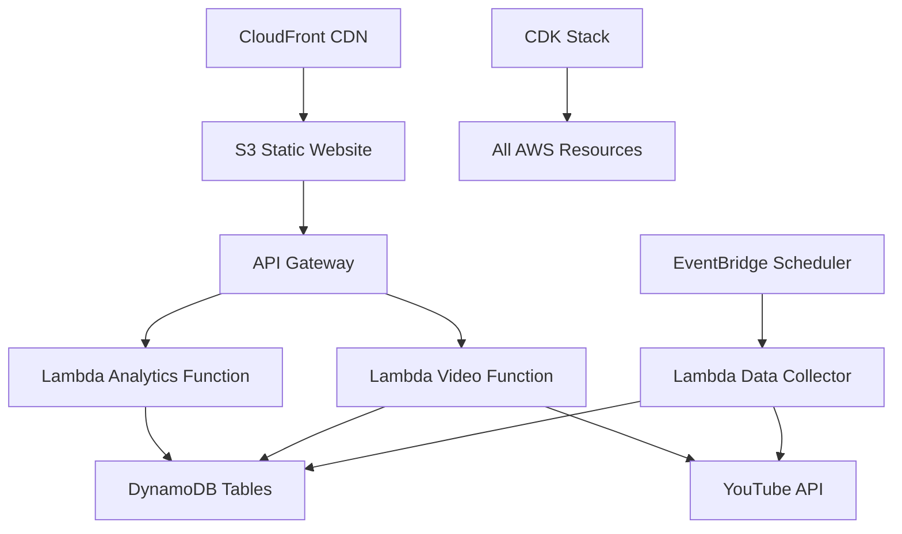

# Design Document

## Overview

The YouTube Keyword Analytics Platform is a configurable, Infrastructure-as-Code (IaC) solution that provides real-time insights into any keyword's popularity on YouTube through visual analytics and video rankings. Built using AWS CDK, the system can be deployed with custom parameters to create dedicated ranking dashboards for any topic, product, or keyword. Kiro IDE serves as the initial implementation example, but the platform is designed for reusability across different use cases.

## Architecture

### High-Level AWS Architecture



### AWS Components

1. **CloudFront + S3** - Static website hosting for React dashboard
2. **API Gateway** - RESTful API with Lambda integration
3. **Lambda Functions** - Serverless compute for analytics, video service, and data collection
4. **DynamoDB** - Serverless NoSQL database for video data and analytics
5. **EventBridge** - Scheduled data collection triggers
6. **CDK Stack** - Infrastructure as Code deployment and configuration

### CDK Configuration Parameters

The system is designed to be deployed with configurable parameters for different keywords and use cases:

```typescript
interface RankingSystemConfig {
  // Core Configuration
  keywordName: string;           // e.g., "Kiro", "React", "Docker"
  searchTerms: string[];         // e.g., ["Kiro IDE", "AWS Kiro", "Kiro tutorial"]
  
  // Branding & UI
  brandName: string;             // Display name for the dashboard
  primaryColor: string;          // Theme color for the UI
  logoUrl?: string;              // Optional logo URL
  
  // Data Collection
  collectionFrequency: number;   // Minutes between data collection runs
  trendUpdateFrequency: number;  // Hours between trend analytics updates (default: 24)
  maxVideosPerSearch: number;    // Limit videos per search query
  
  // Performance & Scaling
  cacheTTLMinutes: number;       // Lambda in-memory cache TTL (default: 5 minutes)
  maxConcurrentUsers: number;    // Expected concurrent user load
  
  // Environment
  environment: 'dev' | 'staging' | 'prod';
  domainName?: string;           // Custom domain for production
}
```

### Multi-Tenant Architecture

The system supports multiple keyword deployments through:

1. **Isolated Stacks**: Each keyword gets its own CDK stack with isolated resources
2. **Shared Components**: Common Lambda layers and utility functions are shared
3. **Environment Separation**: Dev/staging/prod environments per keyword
4. **Cost Optimization**: DynamoDB on-demand pricing scales to zero when not in use

## Components and Interfaces

### Frontend Components

#### Dashboard Layout
- **Header**: Kiro branding and navigation
- **Analytics Section**: Trend graphs and metrics
- **Rankings Section**: Time-based video lists
- **Footer**: Links and information

#### Chart Components
- **TrendChart**: Line chart for cumulative video submissions
- **ViewsChart**: Area chart for total view counts
- **MetricsCards**: Summary statistics (total videos, total views, growth rate)

#### Video Components
- **VideoCard**: Individual video display with thumbnail, title, metadata
- **RankingList**: Ordered list of videos for each time period
- **TimeSelector**: Tabs for Daily/Weekly/Monthly rankings
- **VideoCountSelector**: Dropdown/buttons for adjusting number of displayed videos (5, 10, 20, 50)

### Backend Services

#### Analytics Service API
```typescript
interface AnalyticsAPI {
  getTrendData(period: string): Promise<TrendData>
  getViewMetrics(period: string): Promise<ViewMetrics>
  getGrowthStats(): Promise<GrowthStats>
}

interface TrendData {
  dates: string[]
  videoCount: number[]
  cumulativeCount: number[]
}

interface ViewMetrics {
  dates: string[]
  totalViews: number[]
  dailyViews: number[]
}
```

#### Video Service API
```typescript
interface VideoAPI {
  getRankings(period: 'daily' | 'weekly' | 'monthly', limit?: number): Promise<VideoRanking[]>
  getVideoDetails(videoId: string): Promise<VideoDetails>
  searchVideos(query: string): Promise<VideoDetails[]>
}

interface VideoRanking {
  rank: number
  videoId: string
  title: string
  channelName: string
  viewCount: number
  uploadDate: string
  thumbnail: string
  duration: string
}
```

### Data Collection Service

#### YouTube API Integration
- **Search Queries**: Configurable keyword combinations (e.g., for Kiro: "Kiro IDE", "AWS Kiro", "Kiro tutorial", "Kiro demo")
- **Data Points**: Video metadata, view counts, upload dates, channel info
- **Collection Frequency**: Configurable via CDK parameters (default: every 30 minutes)
- **Rate Limiting**: Respect YouTube API quotas with exponential backoff

#### CDK Deployment Structure
```
cdk/
├── lib/
│   ├── ranking-system-stack.ts      # Main CDK stack
│   ├── constructs/
│   │   ├── frontend-construct.ts    # S3 + CloudFront
│   │   ├── api-construct.ts         # API Gateway + Lambda
│   │   ├── database-construct.ts    # DynamoDB Tables
│   │   └── collector-construct.ts   # EventBridge + Lambda
│   └── config/
│       ├── kiro-config.ts          # Kiro-specific configuration
│       └── base-config.ts          # Default configuration template
├── bin/
│   └── deploy.ts                   # CDK app entry point
└── config/
    └── environments/               # Environment-specific configs
        ├── dev.json
        ├── staging.json
        └── prod.json
```

## Data Models

### DynamoDB Table Design

#### Videos Table
```typescript
interface VideoItem {
  PK: string;           // "VIDEO#{videoId}"
  SK: string;           // "METADATA"
  videoId: string;      // YouTube video ID
  title: string;
  description?: string;
  channelId: string;
  channelName: string;
  uploadDate: string;   // ISO date string
  duration: number;     // seconds
  thumbnailUrl: string;
  createdAt: string;    // ISO timestamp
  updatedAt: string;    // ISO timestamp
  GSI1PK: string;       // "CHANNEL#{channelId}"
  GSI1SK: string;       // uploadDate for sorting
}
```

#### Video Stats Table (Time Series Data)
```typescript
interface VideoStatsItem {
  PK: string;           // "VIDEO#{videoId}"
  SK: string;           // "STATS#{timestamp}"
  videoId: string;
  viewCount: number;
  likeCount?: number;
  commentCount?: number;
  recordedAt: string;   // ISO timestamp
  GSI1PK: string;       // "STATS#{date}" for daily aggregation
  GSI1SK: string;       // "#{videoId}#{timestamp}"
}
```

#### Rankings Table
```typescript
interface RankingItem {
  PK: string;           // "RANKING#{period}#{date}" (e.g., "RANKING#daily#2024-01-15")
  SK: string;           // "#{rank:03d}#{videoId}" (e.g., "001#abc123")
  videoId: string;
  rankPosition: number;
  viewCount: number;
  periodType: 'daily' | 'weekly' | 'monthly';
  rankDate: string;     // ISO date string
  GSI1PK: string;       // "VIDEO#{videoId}"
  GSI1SK: string;       // "RANK#{period}#{date}"
}
```

#### Analytics Aggregates Table
```typescript
interface AnalyticsItem {
  PK: string;           // "ANALYTICS#{period}" (e.g., "ANALYTICS#daily")
  SK: string;           // date (e.g., "2024-01-15")
  date: string;
  videoCount: number;   // New videos on this date
  totalViews: number;   // Total views for all videos on this date
  cumulativeVideos: number; // Running total of videos
  cumulativeViews: number;  // Running total of views
  periodType: 'daily' | 'weekly' | 'monthly';
  GSI1PK: string;       // "TRENDS"
  GSI1SK: string;       // "#{period}#{date}"
}
```

### DynamoDB Access Patterns

#### Primary Access Patterns
1. **Get Video Details**: `PK = "VIDEO#{videoId}", SK = "METADATA"`
2. **Get Video Stats History**: `PK = "VIDEO#{videoId}", SK begins_with "STATS#"`
3. **Get Rankings by Period**: `PK = "RANKING#{period}#{date}"`
4. **Get Analytics Trends**: `PK = "ANALYTICS#{period}"`

#### Global Secondary Index (GSI1) Patterns
1. **Videos by Channel**: `GSI1PK = "CHANNEL#{channelId}"`
2. **Stats by Date**: `GSI1PK = "STATS#{date}"`
3. **Video Rankings**: `GSI1PK = "VIDEO#{videoId}", GSI1SK begins_with "RANK#"`
4. **Trend Analysis**: `GSI1PK = "TRENDS"`

### Data Processing Pipeline

#### Trend Calculation
1. **Video Submission Trends**: Count new Kiro videos by date
2. **Cumulative Growth**: Running total of all Kiro videos over time
3. **View Aggregation**: Sum all view counts by time period
4. **Growth Rate**: Calculate percentage change over periods

#### Ranking Algorithm
1. **Time Period Filtering**: Filter videos by upload/trending date
2. **View Count Sorting**: Order by current view count for period
3. **Rank Assignment**: Assign positions 1-N for each time period
4. **Tie Breaking**: Use upload date (newer first) for equal view counts

## Error Handling

### API Error Responses
```typescript
interface ErrorResponse {
  error: string
  message: string
  code: number
  timestamp: string
}
```

### Error Scenarios
1. **YouTube API Failures**: Return cached data with staleness indicator
2. **Database Connectivity**: Graceful degradation with error messages
3. **Missing Video Data**: Display placeholder content with error indication
4. **Rate Limiting**: Queue requests and retry with exponential backoff

### Fallback Strategies
- **Cached Data**: Serve stale data when APIs are unavailable
- **Partial Loading**: Load available sections while others fail
- **Error Boundaries**: Prevent component crashes from affecting entire app
- **Retry Logic**: Automatic retry for transient failures

## Testing Strategy

### Unit Testing
- **Frontend Components**: Jest + React Testing Library
- **API Endpoints**: Supertest for Express routes
- **Data Processing**: Unit tests for ranking algorithms
- **Utility Functions**: Test data transformation and validation

### Integration Testing
- **API Integration**: Test YouTube API integration with mock responses
- **Database Operations**: Test CRUD operations with test database
- **End-to-End Workflows**: Test complete data collection to display pipeline

### Performance Testing
- **Load Testing**: Simulate 500 concurrent users
- **API Response Times**: Ensure sub-2-second response times
- **Chart Rendering**: Test with large datasets (1000+ videos)
- **Memory Usage**: Monitor for memory leaks in data processing

### Data Quality Testing
- **YouTube API Validation**: Verify data accuracy and completeness
- **Ranking Consistency**: Ensure rankings match expected algorithms
- **Trend Accuracy**: Validate trend calculations against known data
- **Cache Consistency**: Verify cached data matches source data

## Performance Considerations

### Frontend Optimization
- **Code Splitting**: Lazy load chart components
- **Memoization**: Cache expensive chart calculations
- **Virtual Scrolling**: Handle large video lists efficiently
- **Image Optimization**: Lazy load video thumbnails

### Backend Optimization
- **DynamoDB Design**: Single-table design with efficient access patterns
- **Caching Strategy**: Lambda in-memory caching for frequently accessed data
- **API Rate Limiting**: Prevent abuse and ensure fair usage
- **Batch Operations**: Use DynamoDB batch operations for bulk writes

### Data Collection Optimization
- **Batch Processing**: Collect multiple videos per API call
- **Incremental Updates**: Only fetch new/changed data
- **Parallel Processing**: Concurrent API calls within rate limits
- **Data Compression**: Minimize storage and transfer costs

## Deployment and Configuration

### CDK Deployment Process

#### Initial Setup
```bash
# Clone the repository
git clone <repository-url>
cd youtube-ranking-system

# Install dependencies
npm install

# Configure for your keyword
cp config/templates/base-config.ts config/my-keyword-config.ts
# Edit my-keyword-config.ts with your parameters
```

#### Configuration Example (Kiro)
```typescript
// config/kiro-config.ts
export const kiroConfig: RankingSystemConfig = {
  keywordName: 'kiro',
  searchTerms: ['Kiro IDE', 'AWS Kiro', 'Kiro tutorial', 'Kiro demo'],
  brandName: 'Kiro Analytics Dashboard',
  primaryColor: '#FF9900', // AWS Orange
  collectionFrequency: 30,
  trendUpdateFrequency: 24, // Update trends every 24 hours
  maxVideosPerSearch: 50,
  cacheTTLMinutes: 5, // Lambda in-memory cache TTL
  maxConcurrentUsers: 500,
  environment: 'prod'
};
```

#### Deployment Commands
```bash
# Deploy development environment
cdk deploy RankingSystem-kiro-dev --context config=kiro-config

# Deploy production environment
cdk deploy RankingSystem-kiro-prod --context config=kiro-config --context env=prod

# Deploy for different keyword
cdk deploy RankingSystem-react-prod --context config=react-config --context env=prod
```

### Environment Management

#### AWS Resources per Environment
- **Development**: DynamoDB on-demand mode, basic Lambda memory, basic monitoring
- **Staging**: DynamoDB on-demand mode, production-like Lambda settings
- **Production**: DynamoDB provisioned mode (if predictable traffic), enhanced monitoring

#### Cost Optimization
- **DynamoDB On-Demand**: Scales to zero when not in use, perfect for dev/staging
- **Auto-scaling**: Lambda concurrency limits based on expected load
- **Data Lifecycle**: Implement TTL for old video stats to reduce storage costs
- **Lambda Caching**: Use in-memory caching within Lambda functions for cost-effective performance

## Security Considerations

### API Security
- **Rate Limiting**: Prevent API abuse with API Gateway throttling
- **Input Validation**: Sanitize all user inputs in Lambda functions
- **CORS Configuration**: Restrict cross-origin requests to known domains
- **API Key Management**: Store YouTube API credentials in AWS Secrets Manager

### Infrastructure Security
- **IAM Roles**: Least privilege access for all Lambda functions
- **DynamoDB Encryption**: Encryption at rest and in transit
- **API Gateway**: TLS encryption for all API communications
- **WAF Integration**: Web Application Firewall for CloudFront

### Data Protection
- **No Personal Data**: Only collect public YouTube metadata
- **Data Retention**: Implement DynamoDB TTL for automatic data lifecycle management
- **Audit Logging**: CloudTrail for infrastructure changes, CloudWatch for application logs
- **Backup Strategy**: DynamoDB point-in-time recovery and on-demand backups